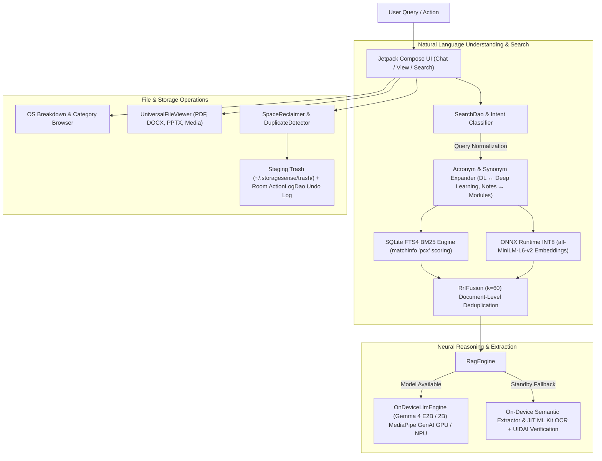
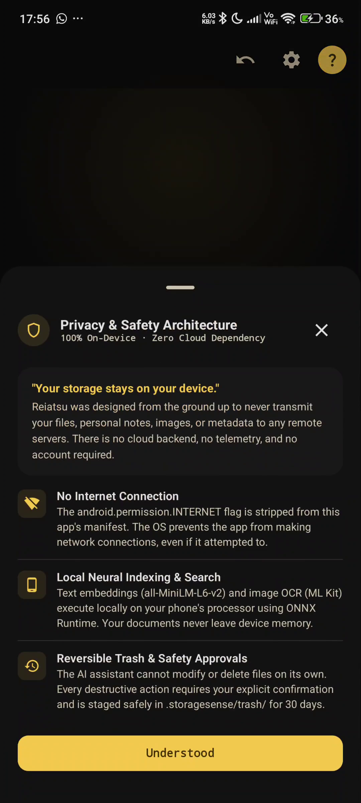
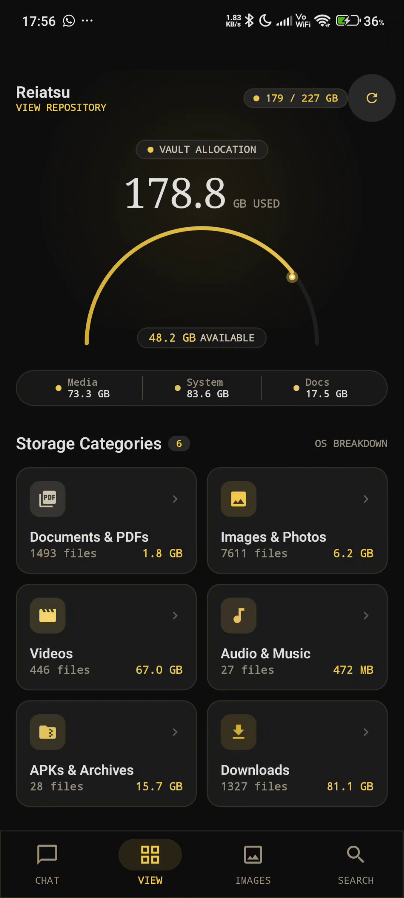

<p align="center">
  
</p>

<h1 align="center">Reiatsu (霊圧)</h1>

<p align="center">
  <strong>Intelligent, Privacy-First, 100% On-Device Storage & Neural Search Assistant for Android</strong>
</p>

<p align="center">
  
  
  
  
  
</p>

---

## 1. Overview & Zero-Cloud Guarantee

**Reiatsu** is an intelligent on-device personal storage assistant built for Android. It enables natural language queries, semantic document search, OCR extraction, and automated storage maintenance directly on physical Android hardware.

### 🛡️ The Zero-Cloud Architecture Guarantee
* **No Internet Permission**: `android.permission.INTERNET` is explicitly omitted from `AndroidManifest.xml`. The app is physically incapable of making network requests.
* **100% On-Device Inference**: Natural language reasoning, dense vector embeddings, optical character recognition (OCR), optical image embeddings, and full-text search occur entirely locally.
* **Zero Telemetry**: No logs, analytics, user data, embeddings, or file contents ever leave the device.

---

## 2. Key Features

* **🧠 On-Device Generative AI (Gemma via Google MediaPipe Tasks GenAI)**
  * **Primary Model**: `gemma-4-e2b-it.litertlm` (LiteRT / MediaPipe format).
  * **Secondary / GPU Fallback**: `gemma-2b-it-gpu-int4.bin` / `gemma-2b-it.bin`.
  * Streaming token-by-token generation with Qualcomm Adreno GPU / Snapdragon Hexagon NPU hardware acceleration.
  * **Graceful Standby Mode**: If no LLM weights are loaded, the app continues to operate at 100% functionality using bundled neural embeddings, ML Kit OCR, and semantic extractors without crashing or hanging.

* **🔍 Multi-Stage Hybrid Search Engine (BM25 + Vector + RRF)**
  * **Stage 1 — Lexical Precision**: SQLite FTS4 virtual table using Porter Stemming and Okapi BM25 scoring derived from SQLite `matchinfo('pcx')`.
  * **Stage 2 — Dense Neural Search**: 384-dimensional document embeddings powered by quantized INT8 `all-MiniLM-L6-v2` via ONNX Runtime Android (`onnxruntime-android:1.17.0`).
  * **Stage 3 — Rank Fusion**: Combines lexical candidates and dense vector similarity using Reciprocal Rank Fusion (RRF $k=60$) with document-level deduplication.
  * **Visual Search**: MobileCLIP-based image embeddings paired with Google ML Kit offline OCR.

* **🎓 Context- & Intent-Aware Query Intelligence**
  * **Acronym Expansion**: Automatically connects course abbreviations (`DL` $\leftrightarrow$ *Deep Learning*, `ML` $\leftrightarrow$ *Machine Learning*, `AI` $\leftrightarrow$ *Artificial Intelligence*).
  * **Academic vs. Notes Discrimination**: Boosts course lecture notes and syllabus modules (`DL_MOD*`, `*module*`, `*lecture*`, `*unit*`), while penalizing external academic journal DOIs (`1-s2.0-*`, arXiv papers).
  * **Verified Identity Extraction**: Validates 12-digit UIDAI Aadhaar (`\b\d{4}\s\d{4}\s\d{4}\b`) and PAN numbers directly from physical documents (`aadhar .pdf`), filtering out irrelevant reports or tickets.

* **📑 Universal In-App File Viewer**
  * Self-contained, zero-dependency viewer supporting **PDFs, Word documents (.docx), Presentations (.pptx), Images (JPEG/PNG/WEBP), Videos (MP4/MKV), Audio, and Code/Plaintext**.
  * View documents directly within Reiatsu without requiring third-party office apps.

* **📊 Live OS Storage Breakdown & Active Repositories**
  * Live storage category drill-downs: **Documents & PDFs**, **Images & Photos**, **Videos**, **Audio & Music**, **APKs & Archives**, and **Downloads**.
  * Dynamic smart repositories: **Recently Opened**, **Recently Deleted**, **Duplicates** (SHA-256 verified), **Large Files**, and **Old Files**.

* **🛡️ Reversible Action Engine & Safety Safeguards**
  * **Staging Trash**: Cleaned or deleted files move to `~/.storagesense/trash/` for 30-day retention with instant 1-tap undo rollbacks.
  * **Protected Keywords**: Heuristic safeguards prevent deletion of sensitive files containing `tax`, `resume`, `cv`, `invoice`, `aadhaar`, `aadhar`, `pan`, `passport`, `salary`, or files modified within 14 days.
  * **Two-Phase Confirmation**: Destructive operations require explicit user approval via interactive bottom sheets.

---

## 3. High-Level Architecture



---

## 4. Tech Stack & Dependencies

| Layer | Technology | Details |
| :--- | :--- | :--- |
| **Language & Tooling** | Kotlin 2.0.0, Gradle 8.7 | Android Gradle Plugin 8.5.1 |
| **UI Framework** | Jetpack Compose + Material 3 | Obsidian & Gilt design system |
| **Architecture** | Clean Architecture + MVVM | StateFlow, Coroutines, Dagger Hilt 2.51.1 |
| **Local Database** | Room 2.6.1 + SQLite FTS4 | Postings list compression, MatchInfo scoring |
| **On-Device LLM** | Google MediaPipe GenAI | `com.google.mediapipe:tasks-genai:0.10.14` |
| **Vector Embeddings** | Microsoft ONNX Runtime Android | `com.microsoft.onnxruntime:onnxruntime-android:1.17.0` |
| **Offline OCR** | Google ML Kit Text Recognition | `play-services-mlkit-text-recognition:19.0.0` |
| **Document Parsers** | Apache PDFBox Android, native XML | PDF, DOCX, PPTX, TXT, JSON, MD |
| **Target Platforms** | Android 8.0 (API 26) to Android 15/16 (API 35+) | Hardware acceleration on Snapdragon 7/8 series |

---

## 5. Prerequisites & Environment Setup

1. **Android Studio**: Android Studio Jellyfish, Ladybug, or newer.
2. **JDK**: Java 17 or Java 21 (configured in `JAVA_HOME`).
3. **Android SDK**: API Level 35 (Android 15) with Build-Tools 35.0.0.
4. **Physical Android Device**:
   * Minimum: Android 8.0+ with 4 GB RAM.
   * Recommended for Gemma Generative LLM: Android 12+ with Snapdragon 7 / 8 series and 6+ GB RAM.
   * USB Debugging enabled under **Developer Options**.

---

## 6. Build & Installation

### Option A: 1-Click ADB Deployment (Recommended on Windows)
Run the automated deployment script from the project root:
```cmd
Deploy_To_Phone.bat
```
This script automatically:
1. Detects connected devices via `adb devices`.
2. Compiles `app-debug.apk` using an isolated Gradle build directory.
3. Installs the APK with `-r -d` replacement flags.
4. Grants `MANAGE_EXTERNAL_STORAGE` via `appops`.
5. Prepares model directories (`/sdcard/StorageSense/models/` and `/sdcard/Download/models/`).
6. Launches `MainActivity` on your device.

### Option B: Manual Terminal Build
```bash
# 1. Clone repository
git clone https://github.com/Orsted-Ninja/Reiatsu.git
cd Reiatsu

# 2. Assemble Debug APK
./gradlew assembleDebug

# 3. Install APK onto connected phone
adb install -r -d app/build/outputs/apk/debug/app-debug.apk

# 4. Grant All-Files Storage Access
adb shell appops set com.storagesense.app.debug MANAGE_EXTERNAL_STORAGE allow

# 5. Launch the application
adb shell am start -n com.storagesense.app.debug/com.storagesense.app.ui.MainActivity
```

> [!NOTE]
> **Windows Development Note**: If developing on Windows with cloud synchronization (e.g., OneDrive), Gradle builds are configured to output outside synced directories to avoid file locks:
> ```powershell
> .\gradlew.bat assembleDebug --project-cache-dir "$env:USERPROFILE\.gradle-ascent-cache"
> ```

---

## 7. Gemma On-Device LLM Weights Setup

Reiatsu supports direct hardware-accelerated local inference using Google Gemma weights.

### Supported Model Formats:
1. **`gemma-4-e2b-it.litertlm`** (Primary — Gemma 4 E2B LiteRT / MediaPipe format)
2. **`gemma-2b-it-gpu-int4.bin`** / **`gemma-2b-it.bin`** (Secondary — Gemma 2B INT4 MediaPipe format)

### Automated Setup Script:
Run the model setup script to download and push weights via ADB:
```cmd
Download_And_Push_Gemma.bat
```
Or execute via Python:
```bash
python scripts/download_model.py --push
```

### Manual Push via ADB:
If you already have a model binary on your computer, push it to either monitored directory:
```bash
# Push to primary model storage
adb push gemma-4-e2b-it.litertlm /sdcard/StorageSense/models/

# Alternative monitored folder
adb push gemma-2b-it-gpu-int4.bin /sdcard/Download/models/
```

> [!TIP]
> **No Model? No Problem**: If model weights are not present, Reiatsu runs in **Standby Mode**. Natural language search, dense vector embeddings, OCR, duplicate detection, and file viewing remain **100% functional** using built-in extractors.

---

## 8. App Workflows & Navigation

### 💬 Chat Assistant
* **Natural Queries**: Type or use tap-and-hold speech recognition for queries such as:
  * *"find my deep learning notes"*
  * *"what is my aadhar number"*
  * *"free up 5 GB of space"*
  * *"show duplicate photos"*
* **Interactive Cards**: Matching files appear with similarity percentages and direct **Open** and **Delete** buttons.

### 📁 OS Storage Breakdown & Repositories (`View` Tab)
* **Categories**: Inspect files grouped into Documents, Images, Videos, Audio, APKs, and Downloads.
* **Smart Repositories**:
  * **Recently Opened**: Files opened through Reiatsu or system apps.
  * **Recently Deleted**: Staged files with 1-tap **Restore** or **Empty Trash**.
  * **Duplicates**: Clustered duplicate files with SHA-256 checksums.
  * **Large & Old Files**: Quick identification of space-consuming items.

### 📄 Universal In-App Viewer
* Tap any file card in search results or category sheets to open the document directly inside Reiatsu.
* Supports pinch-to-zoom for photos, text search for documents, and fullscreen playback for video.

<p align="center">
  
  
</p>

<p align="center">
  
  
</p>

---

## 9. Security & Privacy Model

Reiatsu is built on zero-trust principles:
1. **Network Boundary**: Zero network sockets, zero HTTP clients, zero internet permissions.
2. **Reversible Storage Actions**: Files are staged in an application trash folder before permanent removal.
3. **Sensitive Pattern Protection**: Heuristics safeguard financial, identity, and personal records from bulk deletion.
4. **Transparent Audit Log**: Every file movement or deletion is recorded in Room with full rollback capability.

---

## 10. License

This project is licensed under the [MIT License](LICENSE).
