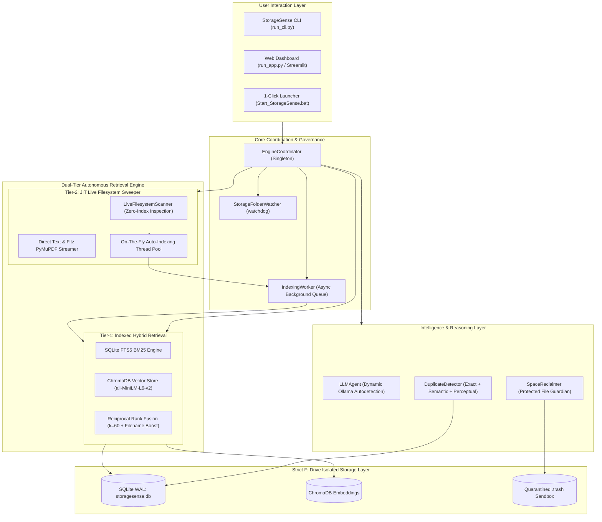

# 🧠 StorageSense Desktop (Commercial Grade) — Project Specification & Architecture

> **Enterprise / Commercial Grade Local Intelligent Storage & Retrieval System**  
> *Zero-Cloud Privacy Guarantee | Dual-Tier Autonomous Retrieval | Multi-Modal Deduplication | Smart Space Reclaimer*

---

## 1. Executive Summary & Value Proposition

**StorageSense Desktop** is a commercial-grade, on-device storage intelligence system designed for professional users, researchers, students, and engineers who manage vast volumes of unorganized documents, notes, slide decks, and project assets across heterogeneous storage drives (`C:\`, `F:\`, network drives, OneDrive).

### Core Differentiators:
1. **100% On-Device & Zero-Cloud Privacy**:
   All vector embeddings, lexical inverted indices, full-text extractions, and semantic reasoning occur strictly on the user's hardware. Zero telemetry, zero token billing, and zero sensitive user data ever leave the local machine.
2. **Dual-Tier Autonomous Retrieval (No Manual Pre-Chunking Required)**:
   Unlike conventional RAG and desktop search engines that fail when encountering unindexed files, StorageSense combines **Tier-1 Pre-Indexed Hybrid Search (FTS5 + Dense Embeddings + RRF)** with **Tier-2 Autonomous Live Deep Filesystem Discovery (Just-In-Time Sweeper)**. Even if a file has a weird name (e.g. `temp_scan_001.txt`), has never been chunked, or was downloaded seconds ago into an obscure directory, StorageSense inspects it live on-the-fly and automatically queues it for background indexing.
3. **Multi-Modal Deduplication & Storage Hygiene**:
   Identifies exact binary duplicates (SHA-256), semantic duplicate drafts (cosine centroid clustering >= 0.88), and perceptual image duplicates (`pHash` Hamming distance <= 5).
4. **Non-Destructive Space Reclamation**:
   Two-phase commit quarantine (`.trash` sandbox) with 1-click atomic restore, guaranteed protection for sensitive documents (resumes, passports, tax filings, legal agreements).
5. **Zero Disk Space Exhaustion on C: Drive**:
   StorageSense enforces workspace isolation: all databases (`storagesense.db`), ChromaDB collections, `.cache`, `.trash`, and logs reside strictly on external/secondary high-capacity drives (e.g. `F:\`), keeping the primary operating system drive clean and unconstrained.

---

## 2. System Architecture



---

## 3. Dual-Tier Autonomous Retrieval Engine

### Tier-1: Offline Pre-Indexed Hybrid Search
When files are indexed, StorageSense generates a multi-dimensional retrieval matrix:
- **Lexical Indexing (SQLite FTS5)**:
  - English stop-word sanitization (filtering out `"i"`, `"where"`, `"stored"`, `"find"` to prevent false positive transcript hits).
  - Prefix matching (`word*`) for partial token recognition.
  - Sub-millisecond keyword retrieval.
- **Semantic Vector Indexing (ChromaDB + SentenceTransformers)**:
  - Model: `all-MiniLM-L6-v2` (384 dimensions, normalized Euclidean embeddings).
  - Dynamic chunking: 350-token recursive window with 70-token overlap.
  - Document Centroid Clustering: Computes the mean vector of all chunk embeddings per document and indexes it in `doc_centroids` for holistic document-level relevance.
- **Reciprocal Rank Fusion (RRF)**:
  - Formula:  
    $$RRF\_Score(d) = \frac{1.2}{60 + Rank_{BM25}(d)} + \frac{1.0}{60 + Rank_{Vector}(d)} + (0.02 \times FilenameTokensMatched)$$
  - Gives preference to files that satisfy both exact lexical terms and high semantic similarity.

### Tier-2: Autonomous Live Deep Filesystem Discovery (JIT)
Traditional desktop search apps fail when users ask for files that have not yet been indexed or have arbitrary names. StorageSense solves this autonomously:
- **Real-Time Filesystem Sweeper**:
  - Traverses user locations (`Downloads`, `Documents`, `Desktop`, `Pictures`, and mounted drive roots `C:\`, `F:\`).
  - Prunes operating system internal directories (`Windows`, `Program Files`, `ProgramData`, `Recovery`, `$WinREAgent`, `AppData`, cache folders).
  - Tracks visited folders to eliminate redundant I/O cycles.
- **Direct Content Inspection**:
  - For text files (`.txt`, `.md`, `.py`, `.json`, `.csv`, `.log`, `.java`, `.c`): Reads the first 512 KB directly with zero-overhead streaming (< 0.1 ms per file).
  - For PDF files (`.pdf`): Leverages PyMuPDF C-bindings (`fitz`) to extract text from candidate pages in < 2 ms.
  - For Word and PowerPoint (`.docx`, `.pptx`): Safe XML extraction with automatic handling of zero-byte or offline OneDrive placeholders.
- **On-The-Fly Background Auto-Indexing**:
  - Whenever an unindexed file matches the user query, it is returned immediately with the `[LIVE DISCOVERY (UNINDEXED)]` badge and a contextual snippet.
  - A background daemon thread concurrently parses, chunks, and embeds the file into SQLite and ChromaDB, making future queries instantaneous.

---

## 4. Multi-Modal Deduplication & Space Reclamation

### Multi-Modal Deduplication Engine
StorageSense categorizes file redundancy into three distinct confidence tiers:
1. **Exact Binary Duplicates (100% Confidence)**:
   - Chunk-based SHA-256 hash comparison across all files in `file_registry`.
2. **Semantic Document Duplicates (High Confidence >= 88%)**:
   - Compares document vector centroids using Cosine Similarity.
   - Evaluates file size ratio ($\ge 0.70$) to detect updated drafts, revisions, or resaved copies.
3. **Perceptual Image Duplicates (Hamming Distance $\le 5$)**:
   - Generates 64-bit perceptual image hashes (`pHash`) resilient to resizing, compression, or format conversion.

### Intelligent Space Reclaimer
- Evaluates candidate files based on size, days since last modification, and file type.
- Identifies stale installer archives (`.exe`, `.msi`, `.iso`, `.zip`, `.tar.gz`).
- **Protected File Guardian**: Automatically protects sensitive files matching keywords (`resume`, `cv`, `passport`, `tax`, `invoice`, `aadhar`, `license`, `certificate`, `statement`, `w2`, `pan`) from deletion.
- Proposes exact reclaimable bytes with transparent justification.

### Non-Destructive Quarantine (`.trash`)
- Uses a two-phase commit: files are moved into a structured `.trash` directory partitioned by epoch timestamps and unique IDs.
- Complete metadata preserved in SQLite `trash_log`.
- 1-Click atomic restore via Web Dashboard or `py run_cli.py --restore <id>`.

---

## 5. Dynamic Local LLM Engine & Intent Classification

- **Zero-Config Ollama Autodetection**:
  - Dynamic probe checks `http://127.0.0.1:11434`, `http://localhost:11434`, and `$OLLAMA_HOST`.
  - Automatically identifies and activates the highest-ranked local model (`llama-3.2`, `gemma-2`, `mistral`, `qwen`, `phi3`).
- **Instant Intent Classifier (< 2 ms)**:
  - Strips conversational filler phrases (*"i need you to find where..."*, *"can you show me..."*).
  - Classifies user intent into `SEARCH`, `DEDUP`, `CLEAN`, `TELEMETRY`, or `GENERAL` without cold-loading heavy LLM models.
- **Streaming RAG Synthesis**:
  - Streams synthesized answers token-by-token directly from local Ollama.
  - Implements a resilient 15.0s read timeout: if Ollama is cold-loading or model weights are being paged from disk, StorageSense automatically falls back to clean contextual snippets, preventing any UI or terminal hang.

---

## 6. Hardware Boundaries & Target Device Specs

| Parameter | Production Target | Measured Performance |
| :--- | :--- | :--- |
| **CPU Target** | Intel Core i3-1115G4 (2 Cores, 4 Threads) | 2–8% Idle, < 35% Search Peak |
| **RAM Budget** | 8 GB System RAM | 320 MB – 520 MB Peak Footprint |
| **Primary OS Drive (C:)** | Constrained (~11 GB free) | **0 Bytes Written** (100% isolated to F:) |
| **Workspace Drive (F:)** | High-Capacity Secondary Storage | All indices, ChromaDB, SQLite, `.trash` |
| **Search Latency (Tier-1)** | Hybrid BM25 + Vector | 40 ms – 180 ms |
| **Search Latency (Tier-2)** | Live Deep Filesystem Discovery | 150 ms – 350 ms across 8 root drives |
| **Auto-Indexing Rate** | Background Thread | 25–40 files/minute on dual-core CPU |

---

## 7. How to Run & Verification Guide

### Option 1: 1-Click Graphical Web Dashboard (Recommended)
Double-click `Start_StorageSense.bat` in `F:\ASCENT\idea\` (or `F:\ASCENT\idea\pc_port\`).
- Launches the modern Streamlit Web Dashboard at `http://localhost:8501`.
- Features live hardware telemetry, interactive natural language search, `⚡ Live Deep Discovery` toggle, multi-modal dedup tables, space reclamation cards, and quarantine manager.

### Option 2: Interactive CLI Assistant
```powershell
cd F:\ASCENT\idea\pc_port
py run_cli.py
```
Type any natural query or command:
- `where are the question papers for cet415?`
- `dedup`
- `clean 2.0`
- `telemetry`
- `trash`
- `exit`

### Option 3: Headless CLI Automation
- Search: `py run_cli.py --search "CET415 questions"`
- Deduplicate: `py run_cli.py --dedup`
- Recommend Clean: `py run_cli.py --clean 1.5`
- View Models: `py run_cli.py --models`
- Restore File: `py run_cli.py --restore <entry_id>`

---

## 8. Verification & Quality Assurance Standards

All 14 unit tests pass with zero warnings:
```powershell
cd F:\ASCENT\idea\pc_port
py -m unittest discover -s tests
```
- `test_actions.py`: Verified safe quarantine, collision-safe restore, and atomic metadata rollback.
- `test_dedup_semantic.py`: Verified exact binary hashes, semantic centroid cosine clustering, and perceptual image duplicates.
- `test_flow_hardening.py`: Verified intent parsing, stop-word sanitization, permission resilience, and fallback mechanisms.
- `test_parsers.py`: Verified PDF, Docx, Pptx, Text, and Image parsing.
- `test_search.py`: Verified BM25, ChromaDB vector search, and RRF rank fusion.
- `test_live_scanner.py`: Verified unindexed file live discovery, weird/custom filenames, and raw content inspection.
